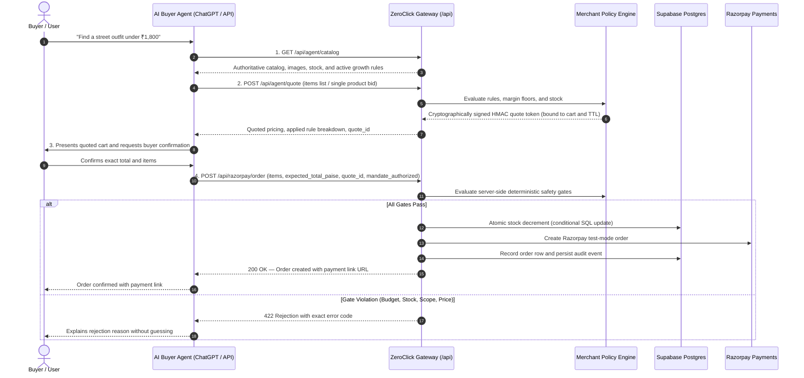

# ZeroClick

ZeroClick is a merchant-side revenue control plane for agentic commerce. It exposes a real, machine-readable catalog and merchant-configured growth rules to external AI buyers, while deterministic server-side gates control product identity, pricing, discount eligibility, inventory, quote scope, budgets, idempotency, and Razorpay test-mode order creation. Every quote, checkout attempt, applied rule, and rejection is recorded in a durable audit trail with an explanation of the decision.

---

## 1. What ZeroClick Solves

Autonomous buyer agents operate without visual checkout forms. When an external AI agent negotiates prices, selects items, or initiates checkout, merchants face significant operational risks:

* **Price Hallucination & Unauthorized Discounts:** AI models can invent discounts or miscalculate combined totals.
* **Inventory Overselling:** Concurrent agent checkouts can deplete stock without atomic allocation controls.
* **Margin Erosion:** Ungated promotions can stack uncontrollably below product margin floors.
* **Lack of Auditability:** Traditional ecommerce gateways do not record policy versioning, negotiation traces, or rule evaluation reasons.

ZeroClick provides the merchant-side control layer. Merchants define bounds, growth incentives, and safety policies. When an AI buyer agent interacts with the store, all pricing math, discount logic, stock reservation, and payment orders are computed and validated strictly by the server.

---

## 2. Live Demo Flow

The end-to-end commerce loop operates through five explicit stages:



1. **Catalog & Offer Discovery (`GET /api/agent/catalog`):** The AI agent retrieves active products, sizes, live stock counts, and merchant growth incentives.
2. **Authoritative Quoting (`POST /api/agent/quote`):** The agent submits items or a bid. The backend computes discounts, evaluates margin floors, and returns an HMAC-SHA256 signed quote token with expiration metadata.
3. **Explicit Buyer Confirmation:** The agent presents the quoted total, savings, and delivered quantities to the human buyer for confirmation.
4. **Order Creation (`POST /api/razorpay/order`):** The agent submits the confirmed cart with the signed `quote_id`. The server runs deterministic gates, atomically reserves inventory, and generates a Razorpay test-mode order with a payment link URL.
5. **Durable Ledger Persistence (`GET /api/agent/ledger`):** Every action, gate result, and arithmetic breakdown is saved to Supabase for auditability.

---

## 3. What the AI Decides vs. What the Merchant Backend Decides

The AI interprets buyer intent, recommends relevant products or eligible offers, and decides when to request a quote. It does not decide the authoritative price, discount eligibility, inventory availability, budget permission, quote validity, or payment outcome. The ZeroClick backend independently recalculates and validates every money action. When the request is ambiguous, multi-item scope is unsupported, a quote is stale, or a safety boundary is exceeded, the agent must stop and explain rather than guess.

| Dimension | AI Buyer Agent Responsibility | ZeroClick Merchant Backend Responsibility |
| :--- | :--- | :--- |
| **Catalog Intent** | Parses buyer preferences and filters categories | Returns authoritative items, stock, and capability manifest |
| **Pricing & Math** | Proposes cart items or requests quotes | Authoritatively calculates subtotal, discounts, and final total in paise |
| **Discount Eligibility** | Discovers available growth rules | Deterministically verifies volume tiers, bundle rules, and eligibility |
| **Inventory** | Reads display stock count | Executes atomic database reservation (`gte stock, quantity`) |
| **Quote Integrity** | Retains and forwards `quote_id` | Verifies cryptographic HMAC signature, TTL, cart scope, and policy version |
| **Spending Limits** | Requests order within stated user budget | Enforces merchant autonomous spending cap (`BUDGET_CAP_EXCEEDED`) |
| **Payment Order** | Sends checkout payload upon user consent | Creates Razorpay test-mode order and generates payment link URL |

---

## 4. Merchant Control Center

The Merchant Control Center provides a web-based management interface organized into four areas:

1. **Overview:** Displays operational telemetry including settled order counts, average order value, delivered buyer savings, growth conversion rates, and authoritative Postgres product inventory.
2. **Growth Rules:** Visual interface for configuring and activating merchant growth incentives (bundles, volume tiers, buy X get Y, cross-sells, welcome deals) with economics preview.
3. **Agent Policy:** Configuration of global autonomous checkout spending caps, quote TTL duration, policy mandate requirement flags, margin floor guardrails, and version snapshot rollback controls.
4. **Activity & Ledger:** Chronological audit trail of agent interactions, grouped by session journey, with detailed trace drawers explaining why each decision was allowed or blocked.

---

## 5. Deterministic Safety Gates

Before creating a Razorpay order, the backend enforces eight server-side safety gates in sequence:

| Gate | Name | Purpose | Error Code |
| :---: | :--- | :--- | :--- |
| **1** | **Autonomy Permission** | Validates that global agent checkout is enabled by merchant policy. | `AUTONOMY_DISABLED` |
| **2** | **Mandate Consent** | Verifies the buyer consent flag if required by merchant policy. | `MANDATE_REQUIRED` |
| **3** | **HMAC Quote & TTL** | Validates cryptographic HMAC-SHA256 signature and quote expiration timestamp. | `PRICE_MISMATCH` |
| **4** | **Quote Scope Match** | Ensures items, quantities, size variants, and cart ID match the quote scope exactly. | `QUOTE_SCOPE_MISMATCH` |
| **5** | **Price & Rule Integrity** | Recalculates discounts server-side using authoritative database base prices. | `PRICE_MISMATCH` |
| **6** | **Autonomous Budget Cap** | Rejects orders exceeding the merchant-configured maximum spending cap. | `BUDGET_CAP_EXCEEDED` |
| **7** | **Atomic Inventory Stock** | Executes atomic conditional update (`stock >= quantity`) to prevent overselling. | `OUT_OF_STOCK` |
| **8** | **Idempotency & Replay** | Checks idempotency key constraint to prevent duplicate charges or double decrements. | `IDEMPOTENT_REUSE` |

### Failure Example: Budget Cap Exceeded

If a buyer agent attempts to check out an order totaling ₹29,205 when the merchant's active policy sets a ₹4,000 autonomous checkout ceiling:

```json
{
  "status": "error",
  "error": "BUDGET_CAP_EXCEEDED",
  "details": "Order total ₹29205.00 exceeds merchant autonomous spending cap of ₹4000.00.",
  "policy_version": "v4",
  "gate_results": {
    "Autonomy Gate": "PASS",
    "Mandate Bound": "PASS",
    "Budget Cap Gate": "FAIL"
  }
}
```

The server rejects the request with HTTP 422, rolls back any reserved state, and writes a `CHECKOUT_BLOCKED` audit event to the Trust Ledger.

---

## 6. Growth Rules & Personalization

The growth engine evaluates promotions deterministically. Rules are categorized by their verification status:

### Live-Demonstrated Rules
* **Buy 3 Get 1 Free (`buy_x_get_y`):** Tested on items like *Crew Socks 3-Pack*. Ordering 4 units calculates 4 delivered, 3 paid, 1 free, and charges the exact 3-unit total.
* **Volume Quantity Tiers (`quantity_discount`):** Tested on items like *Argentina Sun Tee*. Automatically applies tiered percentage discounts based on ordered quantity thresholds.
* **Multi-Product Bundle Quotes (`bundle_discount`):** Demonstrated on combos such as *Complete Outfit Bundle* (Tee + Cargo Pants). Calculates the combined subtotal, applies the 10% bundle discount, and returns a signed quote token.
* **Autonomous Budget Cap Enforcement:** Verified live by rejecting requests exceeding the active policy threshold.

### Implemented & Configurable Rules
* **First-Time Buyer Welcome Offer (`welcome_offer`):** Configurable discount for sessions marked with `is_new_buyer: true`.
* **Returning Buyer Privilege (`returning_buyer_offer`):** Configurable loyalty discount for sessions with `completed_orders_count >= 2`.
* **Cart Threshold Discount (`cart_threshold_offer`):** Flat or percentage discount applied when cart subtotal meets a defined value threshold.
* **Payment Recovery Incentive (`payment_recovery_offer`):** Automated recovery incentive triggered when retrying a failed payment session.
* **Cross-Sell & Upsell (`cross_sell`, `upsell`):** Incentive logic for paired accessory recommendations or premium item upgrades.

---

## 7. Trust Ledger & Explainable Decisions

The Trust Ledger is a durable, Supabase-backed audit store (`public.trust_ledger_events`) recording all commercial events:

* **Event Types:** `QUOTE_ISSUED`, `ORDER_CREATED`, `CHECKOUT_BLOCKED`, `PAYMENT_CAPTURED`, and `POLICY_SNAPSHOT`.
* **Decision Trace Data:** Every entry records the actor, action, session ID, cart ID, policy version reference, amount before, amount after, decision outcome (`ALLOWED` or `BLOCKED`), matched rule IDs, and detailed arithmetic (`subtotal`, `discount`, `final_total`, `buyer_savings`).
* **Traceability:** Merchants can inspect individual transaction traces in the dashboard to review exactly why a discount was approved or why an order was blocked.

---

## 8. Known Limitations & Scope

* **Quote Scope Requirements:** Multi-item checkout requires a signed quote that explicitly covers every item, size, quantity, and total amount. Single-product quotes cannot be submitted with multiple products.
* **Client Image Rendering:** The catalog returns authoritative, absolute HTTPS image URLs (`/products/<slug>.png`), but inline visual rendering depends on the client application (e.g., ChatGPT UI markdown capabilities).
* **Payment Order vs. Payment Capture:** Calling `POST /api/razorpay/order` creates a Razorpay test-mode order and returns a payment link URL. It does not mean payment is captured. Payment capture is recorded only after verified status checks (`GET /api/razorpay/order/status`) or webhook events (`POST /api/razorpay/webhook`).
* **Approval Queues:** ZeroClick eliminates merchant-side manual approval queues. However, buyer-side confirmation and ChatGPT consequential-action consent pauses are client-side steps that remain in effect.
* **Operational Telemetry:** Dashboard overview numbers represent operational telemetry computed from recorded ledger events. They must be distinguished from settled merchant bank disbursements.
* **Mandate Policy Flag:** The `mandate_required` setting is a merchant policy enforcement gate and client consent flag. It does not constitute a banking-level automated recurring payment integration or protocol.

---

## 9. API Endpoints & OpenAPI Contract

### Primary Commerce API

| Method | Endpoint | Description |
| :--- | :--- | :--- |
| `GET` | `/api/agent/catalog` | Returns product drops, stock, variants, image URLs, and active growth rules manifest. |
| `POST` | `/api/agent/quote` | Requests an HMAC-SHA256 signed quote token for single items or multi-item carts. |
| `POST` | `/api/razorpay/order` | Evaluates 8 deterministic safety gates and creates a Razorpay test-mode order. |
| `GET` | `/api/razorpay/order/status` | Verifies the real-time payment status of an existing Razorpay order ID. |
| `POST` | `/api/razorpay/webhook` | Webhook endpoint capturing payment confirmation events to the Trust Ledger. |
| `GET` | `/api/agent/ledger` | Returns durable audit events and journey session traces from Supabase. |
| `GET` | `/api/merchant/config` | Retrieves active merchant policy, growth rules, and version snapshot history. |
| `POST` | `/api/merchant/config` | Updates merchant boundaries and publishes an immutable policy version snapshot. |
| `GET` | `/api/openapi.json` | Machine-readable OpenAPI 3.1.0 specification for AI Buyer Agents and Custom GPT Actions. |

### Protocol-Shaped Compatibility Adapters

ZeroClick includes format adapters that wrap catalog, quote, and checkout actions into protocol-shaped envelopes:
* `GET / POST /api/protocol/adapter?protocol=acp-shaped` (Agent Commerce Protocol envelope)
* `GET / POST /api/protocol/adapter?protocol=ap2-shaped` (Agent Payment Protocol 2 envelope)
* `GET / POST /api/protocol/adapter?protocol=x402-shaped` (HTTP 402 Payment Required envelope)

*Note: These endpoints provide structural compatibility adapters for agent integration testing and do not represent formal certification by external standards bodies.*

---

## 10. Local Setup & Environment Variables

### 1. Environment Configuration (`.env.local`)

```env
NEXT_PUBLIC_SUPABASE_URL=https://your-project.supabase.co
NEXT_PUBLIC_SUPABASE_PUBLISHABLE_KEY=your-anon-key
SUPABASE_SERVICE_ROLE_KEY=your-service-role-key
RAZORPAY_KEY_ID=rzp_test_your_key_id
RAZORPAY_KEY_SECRET=your_key_secret
NEXT_PUBLIC_BASE_URL=http://localhost:3000
```

### 2. Installation & Seed

```bash
# Install project dependencies
pnpm install

# Seed authoritative products to Supabase Postgres
node scratch/seed_catalog.js

# Start local Next.js development server
pnpm dev
```

---

## 11. Test Suite & Verification Commands

The repository includes test scripts to verify pricing math, HMAC signing, gate enforcement, and API routes:

```bash
# Run HMAC signing, multi-item quote verification, and tamper detection tests
npx tsx scratch/test_bundle_quote.js

# Run quote and checkout API integration tests (verifies 10% bundle quote & order creation)
npx tsx scratch/test_api_quote_and_order.js

# Run 24-boundary regression test suite (requires local dev server or live deployment URL)
node scratch/test_growth_platform_regression.js
```

---

## 12. Razorpay Buildathon Track 01 Positioning

ZeroClick addresses **Razorpay Buildathon Track 01 (Agentic Commerce)** by providing the essential merchant-side control infrastructure:

1. **Machine-Readable Merchant Surface:** Exposes products, stock, image URLs, and dynamic growth incentives via OpenAPI 3.1 for autonomous discovery by external AI agents.
2. **Deterministic Server-Side Authority:** Replaces model hallucinations with cryptographic quote binding, paise-level price recalculation, and atomic stock reservation.
3. **Bounded Payment Execution:** Converts verified agent checkouts into bounded Razorpay test-mode payment orders with complete audit traceability.
4. **Explainable Trust Ledger:** Ensures every autonomous commerce decision—whether approved or blocked—is recorded with transparent arithmetic and verifiable business logic.

---

## License

MIT License. Built for autonomous agentic commerce.
