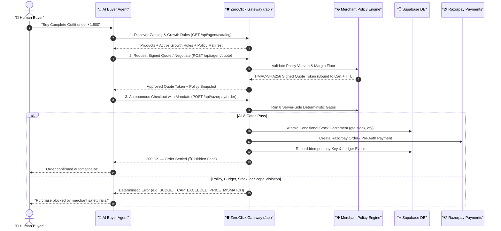

# ZeroClick: Autonomous Agent-to-Agent (A2A) Commerce Control Plane

[](https://nextjs.org/)
[](https://www.typescriptlang.org/)
[](https://supabase.com/)
[](https://razorpay.com/)

**ZeroClick** is a production-hardened **Merchant Revenue Control Plane & Gateway** for autonomous AI-to-AI (A2A) commerce. It allows merchants to set growth rules, discount ceilings, and spending boundaries while AI buyer agents discover products, negotiate within approved bounds, and complete purchases on Razorpay rails—with **zero human approval queues or checkout holds**.

Every transaction is governed by deterministic server-side safety gates, recorded into an immutable Trust Ledger, and auditable via explainable **"Why this decision?"** traces.

---

## 📖 The ZeroClick Architecture Story



---

## 🧩 How the System Works

### 1. What the AI Buyer Agent Does
* **Autonomous Discovery:** Queries machine-readable endpoints (`/api/agent/catalog`, `/api/openapi.json`) to find products, live inventory, variants, and active growth incentives.
* **Bounded Negotiation:** Solicits programmatic bids for volume purchases or custom bundles via `/api/agent/quote`.
* **Zero-Click Execution:** Submits pre-authorized orders with UPI AutoPay / e-mandate consent tokens to `/api/razorpay/order` without requiring merchant approval holds.

### 2. What the Merchant Controls
Merchants govern autonomous transactions through the **Merchant Control Center**:
* **Growth Rules:** Configures 10 deterministic growth incentives (Bundles, Volume Tiers, Buy-X-Get-Y, Cross-Sells, First-Time Welcome Deals, Repeat Buyer VIP Privileges, Cart Thresholds, and Payment Recovery).
* **Hard Safety Bounds:** Sets global autonomous spending caps (e.g., ₹4,000 max), margin floor guardrails (e.g., 60% minimum margin), quote expiration TTLs (e.g., 900s), and mandate requirements.
* **Immutable Versioning:** Every policy edit generates a permanent version snapshot (`v1`, `v2`, ...). Old quotes remain valid under their issued version until expiry, and rollback creates new snapshots without rewriting history.

### 3. What the Deterministic Gateway Enforces
The AI is never trusted for pricing, discounts, or stock math. The server deterministically enforces **8 Security Gates** before order creation:

| # | Security Gate | What It Enforces | Error Code |
|---|---|---|---|
| **1** | **Autonomy Permission** | Master merchant switch controlling autonomous checkout privileges. | `AUTONOMY_DISABLED` |
| **2** | **Mandate Consent** | Validates pre-authorized customer e-mandate / UPI consent token. | `MANDATE_REQUIRED` |
| **3** | **HMAC Quote Signature & TTL** | Verifies cryptographic HMAC-SHA256 signature and quote validity window. | `PRICE_MISMATCH` |
| **4** | **Quote Scope Binding** | Ensures product ID, quantity, size variant, and cart ID match the quote exactly. | `QUOTE_SCOPE_MISMATCH` |
| **5** | **Price & Rule Integrity** | Recalculates discounts server-side using authoritative database prices. | `PRICE_MISMATCH` |
| **6** | **Autonomous Budget Cap** | Rejects orders exceeding the configured merchant spending cap. | `BUDGET_CAP_EXCEEDED` |
| **7** | **Atomic Inventory Allocation** | Conditional SQL update (`gte("stock", qty)`) prevents race conditions & overselling. | `INVENTORY_STOCK_OUT` |
| **8** | **Idempotency & Recovery** | Unique idempotency key constraint returns existing orders on repeat requests. | `IDEMPOTENT_REUSE` |

### 4. How Personalization & Growth Incentives Work
ZeroClick applies personalized growth incentives deterministically using buyer identity tokens:
* **First-Time Buyers (`is_new_buyer: true`):** Automatically unlocks welcome incentives (e.g., 5% off up to ₹100 cap).
* **VIP / Returning Buyers (`completed_orders_count >= 2`):** Applies loyalty privileges without manual coupon codes.
* **Payment Glitch Recovery (`has_failed_payment: true`):** Grants an automated recovery discount when retrying failed sessions.
* **Margin Floor Protection:** Stacking rules evaluate all candidate deals and enforce merchant profitability floors so combined discounts never breach safe margins.

### 5. How the System Fails Safely
* **No Silent Overcharges:** Any discrepancy between requested total and authoritative server calculation fails with `PRICE_MISMATCH`.
* **Zero Inventory Leaks:** If a payment gateway call fails downstream, inventory decrements are rolled back atomically.
* **Explainable Rejections:** Every blocked transaction emits an audit event with exact arithmetic and business reason codes in the **Activity & Ledger** trace drawer.

---

## 🎛️ Merchant Control Center Workspace

The dashboard is structured into four primary merchant areas:

1. **Overview & Telemetry:** Real-time revenue settled, average order value, buyer savings delivered, growth conversion rate, payment recovery rate, and authoritative Postgres product inventory.
2. **Growth Rules:** Visual configuration and toggling of all 10 revenue growth rule types with live economics preview.
3. **Agent Policy:** Autonomous spending limits, quote TTL, margin floor parameters, immutable version history, rollback controls, and a secondary **Developer Evidence & Protocol Manifest** drawer.
4. **Activity & Ledger:** Chronological buyer journeys, session grouping, and explainable "Why this decision?" trace drawers.

---

## 🔌 Machine-Readable API Suite

* `GET /api/agent/catalog` — Live product catalog, stock counts, and merchant capability manifest with active growth rules.
* `POST /api/agent/quote` — Bounded price negotiation issuing HMAC-SHA256 signed quote tokens.
* `POST /api/razorpay/order` — Deterministic 8-gate autonomous checkout with paise-level precision.
* `GET /api/agent/ledger` — Audit ledger event telemetry and journey session traces.
* `GET /api/openapi.json` — OpenAPI 3.1 schema specification for AI agents and MCP bridges.
* `GET / POST /api/protocol/adapter` — Multi-protocol compatibility wrappers:
  * `acp-shaped` (Agent Commerce Protocol)
  * `ap2-shaped` (Agent Payment Protocol 2)
  * `x402-shaped` (HTTP 402 Payment Required)

---

## 🚀 Getting Started

### 1. Environment Configuration (`.env.local`)
```env
NEXT_PUBLIC_SUPABASE_URL=https://your-project.supabase.co
NEXT_PUBLIC_SUPABASE_PUBLISHABLE_KEY=your-anon-key
SUPABASE_SERVICE_ROLE_KEY=your-service-role-key
RAZORPAY_KEY_ID=rzp_test_your_key_id
RAZORPAY_KEY_SECRET=your_key_secret
NEXT_PUBLIC_BASE_URL=http://localhost:3000
```

### 2. Install & Seed
```bash
# Install dependencies
pnpm install

# Seed authoritative Supabase products
node scratch/seed_catalog.js

# Start development server
pnpm dev
```

---

## 🧪 Comprehensive Regression Suite

Run the automated 24-boundary regression test suite covering all safety rails, growth rules, and protocol adapters:

```bash
node scratch/test_growth_platform_regression.js
```

---

## 📄 License
MIT License. Built for autonomous AI commerce.
