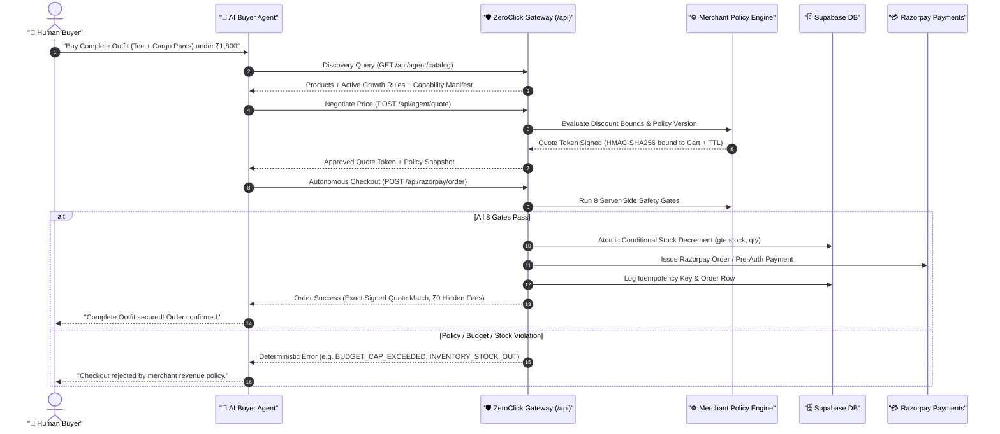

# ZeroClick: Autonomous Agent-to-Agent (A2A) Commerce Control Plane

[](https://nextjs.org/)
[](https://www.typescriptlang.org/)
[](https://supabase.com/)
[](https://razorpay.com/)

**ZeroClick** is a production-hardened **Merchant Revenue Control Plane & Growth Engine** for autonomous AI-buyer commerce. It enables merchants to configure products, dynamic growth rules (bundles, volume discounts, buy-X-get-Y, recovery offers), discount limits, mandate requirements, quote expiry TTLs, and spending caps. AI buyer agents discover catalog drops, negotiate within deterministic boundaries, and execute end-to-end checkout with zero human holds or approval queues.

Every transaction is governed by **8 server-side security gates**, logged into an immutable **Trust Ledger**, and auditable via explainable **"Why this decision?"** traces.

---

## 🏗️ System Architecture



---

## 🛡️ The 8 Deterministic Server-Side Safety Gates

| # | Security Gate | Mechanism & Threat Neutralization | Error Code |
|---|---|---|---|
| **1** | **Autonomy Permission Gate** | Global merchant master switch controlling autonomous checkout permissions. | `AUTONOMY_DISABLED` |
| **2** | **Mandate Consent Gate** | Enforces consent-based UPI Mandate / Reserve Pay pre-authorization. | `MANDATE_REQUIRED` |
| **3** | **HMAC Quote Signature & TTL** | Cryptographically verifies quote token signature and enforces expiry TTL (default: 900s). | `PRICE_MISMATCH` |
| **4** | **Quote Scope Matching** | Binds product ID, quantity, size variant, and cart hash. Rejects scope tampering. | `QUOTE_SCOPE_MISMATCH` |
| **5** | **Price & Growth Rule Integrity** | Authoritative database recalculation of subtotal and active growth/combo discounts. | `PRICE_MISMATCH` |
| **6** | **Autonomous Budget Cap** | Rejects any order exceeding the merchant's configured spending cap limit. | `BUDGET_CAP_EXCEEDED` |
| **7** | **Atomic Inventory Allocation** | Concurrency-safe conditional SQL update (`gte("stock", qty)`). Prevents double-selling. | `INVENTORY_STOCK_OUT` |
| **8** | **Idempotency & Recovery** | Unique idempotency key constraint ensures repeat requests return original orders; exactly-once stock restoration on failure. | `IDEMPOTENT_REUSE` |

---

## 🎛️ Merchant Control Center Workspace

The dashboard is organized into four clean merchant areas:

1. **Overview & Telemetry**: High-level store metrics, settled revenue, average order value, buyer savings delivered, growth conversion rate, payment recovery rate, and authoritative Supabase catalog inventory.
2. **Growth Rules**: Configuration of 10 deterministic revenue growth incentives:
   - **Bundle Discounts** (multi-product outfit & kit deals)
   - **Buy X Get Y** (e.g., Buy 3 Get 1 Free)
   - **Tiered Quantity Discounts** (volume tier discounts)
   - **Cross-Sell & Upsell** (complementary accessory incentives)
   - **Welcome Offers** (first-time buyer privileges)
   - **Returning Buyer Privileges** (repeat customer loyalty deals)
   - **Cart Threshold Offers** (cart total incentives)
   - **Payment Recovery Offers** (automatic discount on retry after payment failure)
   - **Reorder Replenishment** (recurring purchase incentives)
3. **Agent Policy & Versioning**: Immutable policy version history (`v1`, `v2`, ...), quote expiry TTL settings, budget caps, margin floor enforcement, and instant rollback. Includes secondary **Developer Evidence & Protocol Manifest** drawer.
4. **Activity & Trust Ledger**: Chronological journey grouping (`session_id`, `cart_id`, `quote_id`, `order_id`) with explainable **"Why this decision?"** trace drawers displaying buyer intent, exact arithmetic, gate outcomes, and business results.

---

## 🔌 Machine-Readable API Suite

### 1. Catalog Discovery: `GET /api/agent/catalog`
Returns structured JSON drops, inventory stock, variants, studio image URLs, and the **Merchant Capability Manifest** with active growth rules.

### 2. Cryptographic Quote Negotiation: `POST /api/agent/quote`
Evaluates agent bid against merchant category discount limits and issues an HMAC-SHA256 token embedding product ID, price, size, quantity, cart ID, expiry timestamp, and active policy version.

### 3. Autonomous Checkout: `POST /api/razorpay/order`
Evaluates all 8 safety gates, conditionally decrements inventory, and issues Razorpay payment orders with exact paise precision.

### 4. Durable Trust Ledger: `GET /api/agent/ledger`
Returns complete audit event telemetry and journey session traces.

### 5. OpenAPI Specification: `GET /api/openapi.json`
Complete OpenAPI 3.1 specification for custom AI agents, GPT Actions, and MCP bridges.

### 6. Protocol Compatibility Adapters: `GET` & `POST /api/protocol/adapter`
Provides protocol-shaped envelopes for:
- `acp-shaped` (`acp-agentic-commerce-draft`)
- `ap2-shaped` (`ap2-mandate-commerce`)
- `x402-shaped` (`x402-http-payment-required`)

---

## 📦 Demo Catalog & Seed Products

| Product | Base Price | Stock | Negotiable | Max Discount | Studio Photography |
|---|---|---|---|---|---|
| **Argentina Sun of May Tee** | ₹649 | 79 | Yes | 10% | `/products/argentina-sun-tee.png` |
| **Everyday Cargo Pants** | ₹999 | 35 | Yes | 8% | `/products/everyday-cargo-pants.png` |
| **Court Canvas Sneakers** | ₹1,499 | 24 | No | 0% | `/products/court-canvas-sneakers.png` |
| **Essential Street Cap** | ₹399 | 50 | Yes | 5% | `/products/essential-street-cap.png` |
| **Utility Crossbody Sling** | ₹799 | 18 | Yes | 7% | `/products/utility-crossbody-sling.png` |
| **Crew Socks 3-Pack** | ₹249 | 100 | Yes | 5% | `/products/crew-socks-3-pack.png` |

---

## 🚀 Getting Started

### 1. Prerequisites
- Node.js 18+
- pnpm (`npm install -g pnpm`)
- Supabase project & Razorpay test keys

### 2. Environment Configuration (`.env.local`)
```env
NEXT_PUBLIC_SUPABASE_URL=https://your-project.supabase.co
NEXT_PUBLIC_SUPABASE_PUBLISHABLE_KEY=your-anon-key
SUPABASE_SERVICE_ROLE_KEY=your-service-role-key
RAZORPAY_KEY_ID=rzp_test_your_key_id
RAZORPAY_KEY_SECRET=your_key_secret
NEXT_PUBLIC_BASE_URL=http://localhost:3000
```

### 3. Install & Seed
```bash
# Install dependencies
pnpm install

# Seed authoritative products
node scratch/seed_catalog.js

# Start development server
pnpm dev
```

### 4. Build & Production
```bash
# Compile optimized production bundle
pnpm build

# Start production server
pnpm start
```

---

## 🧪 Comprehensive Regression Suite

ZeroClick includes an automated 24-boundary regression test suite covering all safety rails, growth rules, and protocol adapters:

```bash
# Run the complete 24-boundary regression suite
node scratch/test_growth_platform_regression.js
```

---

## 📄 License
MIT License. Built for autonomous AI commerce.
